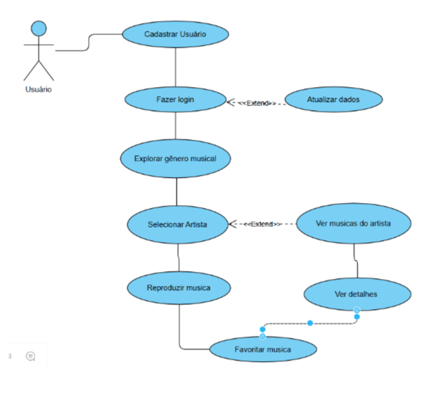
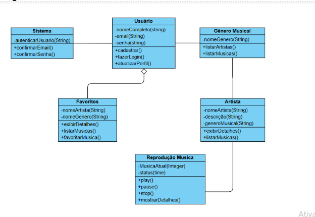
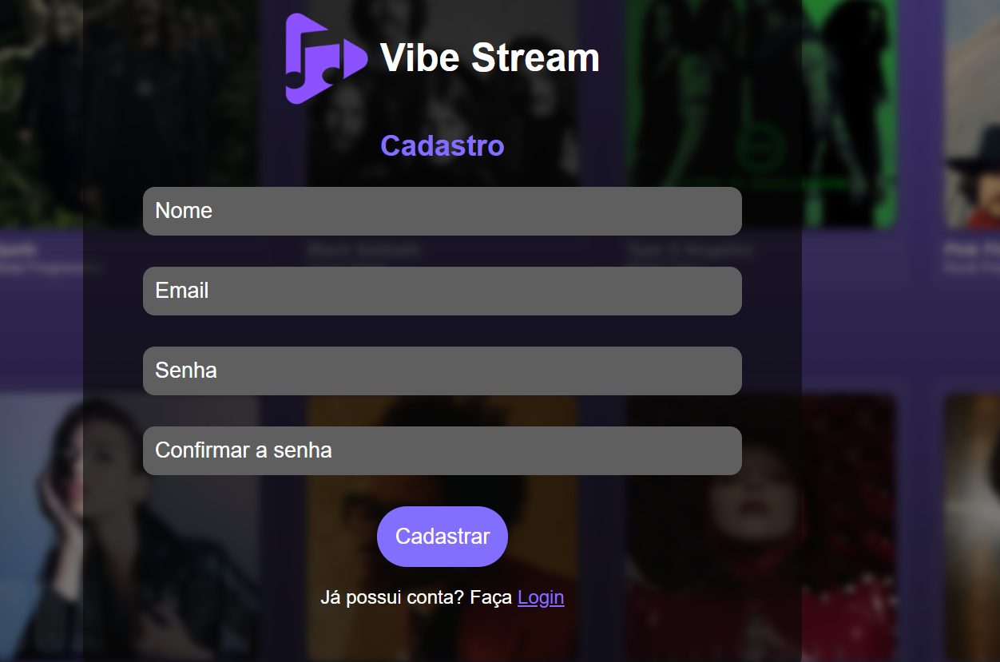
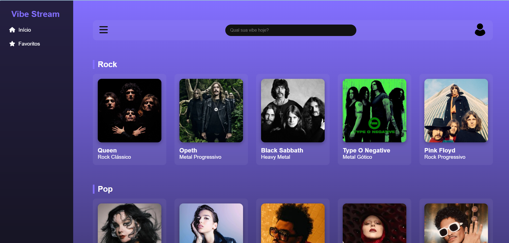
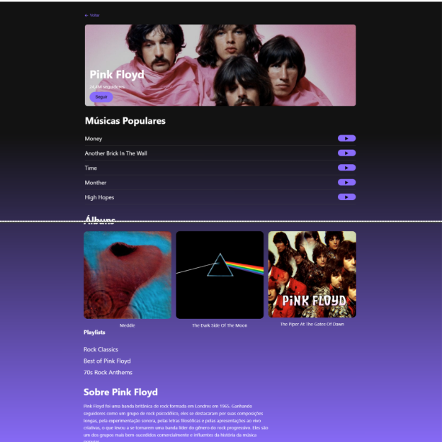

# 🎵 VIBE STREAM

**Escola e Faculdade do Serviço Nacional de Aprendizagem Industrial – Unidade Vila Mariana**  
**Curso Técnico em Desenvolvimento de Sistemas**

**Autores:**  
- Nicoly de Oliveira Machado  
- Pietra Rainone Rocha  
- Rafael Borges Gibertoni  
- Raquel Yukie Tsuji  
- Sabrina Matos Almeida  
- Therciane Fernandes de Vasconcelos  

**São Paulo – SP**  
**2025**

---

## 📘 Resumo

O presente trabalho apresenta o desenvolvimento de um streaming de música, elaborado com o uso das linguagens **HTML**, **CSS** e **JavaScript**.  
O projeto teve como objetivo criar uma plataforma funcional e interativa para reprodução musical, oferecendo ao usuário uma experiência intuitiva e dinâmica.  

Durante o processo de desenvolvimento, foi utilizada a metodologia **Kanban**, que auxiliou na organização das tarefas, no acompanhamento do progresso e na divisão eficiente das etapas de trabalho.  

Entre as principais funcionalidades do sistema, destacam-se:
- Favoritar artistas e músicas;  
- Navegar por diferentes gêneros musicais;  
- Visualizar detalhes sobre os artistas;  
- Reproduzir as faixas disponíveis.

---

## 🎯 Objetivo

**Problema:** Streamings que não possuem experiência personalizada para cada usuário.  
**Objetivo:** Permitir que as pessoas escutem músicas e álbuns de seus artistas favoritos, conheçam mais sobre sua carreira e que o sistema defina seus gostos pessoais.  
**Processos automatizados:** Personalização das playlists e recomendação de artistas.

---

## 🧠 Introdução e Justificativa

Com o crescimento dos serviços de streaming, a personalização da experiência do usuário tornou-se essencial.  
O **Vibe Stream** busca oferecer uma plataforma moderna e personalizada, na qual o usuário possa selecionar artistas e gêneros preferidos, recebendo recomendações conforme seus gostos.  

A justificativa está na necessidade de uma experiência musical mais imersiva e adaptada ao perfil individual, combinando usabilidade, design e interatividade.

---

## 💻 Metodologia Utilizada

A pesquisa teve caráter **quantitativo e qualitativo**, visando compreender as demandas do público-alvo.  
O desenvolvimento foi realizado com:
- **HTML e CSS** – para estrutura e layout das páginas;  
- **JavaScript** – para implementação das funcionalidades e lógica do sistema;  
- **Visual Studio Code** – ambiente de desenvolvimento integrado.

A metodologia **Kanban** foi adotada para organizar tarefas e acompanhar o progresso das etapas de desenvolvimento.

---

## 🎨 Identidade Visual

**Tipografia:** Helvetica, Arial, sans-serif  

**Paleta de Cores:**
- Roxo `#836FFF` → criatividade e arte  
- Preto `#000000` → elegância e imersão  
- Cinza-escuro `#2B2B2B` → equilíbrio  
- Cinza-médio `#5F5F5F` → dinamismo  
- Branco `#FFFFFF` → clareza e liberdade  

**Logo:**

---

## 👥 Equipe e Responsabilidades

| Nome | Função / Cargo | Responsabilidades |
|------|----------------|-------------------|
| **Raquel Yukie Tsuji** | Product Owner (PO) | Coordenar o andamento do projeto, validar etapas e funcionamento geral. |
| **Rafael Borges Gibertoni** | Product Owner / UI Designer | Coordenar o andamento e definir identidade visual. |
| **Nicoly de Oliveira Machado** | Front-End Developer | Desenvolvimento em HTML, CSS e JavaScript. |
| **Pietra Rainone Rocha** | Front-End Developer / Documentadora | Desenvolvimento e documentação. |
| **Sabrina Matos Almeida** | Front-End Developer | Implementação de páginas e navegação. |
| **Therciane Fernandes Vasconcelos** | Designer UI/UX | Criação do logotipo, paleta de cores e layout das telas. |

---

## ⚙️ Funcionalidades do Sistema

- Cadastro e login de usuários;  
- Catálogo com gêneros musicais e artistas;  
- Página de detalhes do artista (álbuns e descrição);  
- Reprodução de músicas com player integrado;  
- Opção de favoritar músicas e artistas;  
- Interface adaptada para desktop e mobile.

---

## 🧩 Modelagem de Software

**Diagrama de Casos de Uso:**  

**Diagrama de Classes:**  

---

## 🖼️ Telas do Sistema

### Tela de Login
O usuário insere seu e-mail e senha cadastrados para acessar o sistema.  
Também é possível criar uma nova conta.

---

### Tela de Cadastro
Formulário para inserção de nome completo, e-mail e senha.  
Após o cadastro, o usuário pode acessar o sistema.

---

### Tela de Catálogo (Home)
Exibe diferentes gêneros musicais e artistas.  
Inclui menu para navegação, perfil e favoritos.

---

### Tela de Detalhes
Mostra informações sobre o artista, como álbuns, músicas e uma breve biografia.

---

### Tela de Reprodução
Permite tocar a música selecionada, com player completo.

---

### Tela de Favoritos
Lista os artistas e músicas marcados como favoritos pelo usuário.

---

## 🚀 Implantação (Deploy)

- **Versão Beta:** 14/10/2025  
- **Versão Estável:** 28/10/2025  

Funcionalidades incluídas:
- Cadastro e login de usuários  
- Reprodução de músicas  
- Visualização de detalhes dos artistas  
- Favoritar artistas e músicas preferidas  

---

## 🧭 Manutenção e Melhorias

| Versão | Data | Alterações |
|---------|------|------------|
| **Beta** | 14/10/2025 | Escopo inicial, layout, paleta e logo definidos |
| **1.0** | 16/10/2025 | Implementação da tela Home |
| **1.1** | 20/10/2025 | Testes nas telas de login e cadastro |
| **1.2** | 25/10/2025 | Melhorias nos layouts das páginas |
| **1.3** | 15/11/2025 | Correções de bugs e melhorias na navegação |

---

## 🧾 Conclusão

A documentação do **Vibe Stream** apresenta todas as etapas de desenvolvimento — desde o levantamento de requisitos e definição de usuários até a prototipagem, codificação, testes e histórico de versões.  

O projeto buscou garantir clareza, organização e rastreabilidade, além de servir como referência para futuras manutenções, melhorias e extensões da aplicação.

---

## 🔗 Referências

- [Spotify](https://www.spotify.com/br-pt/premium/)  
- [Deezer](https://www.deezer.com/br/)  
- [Apple Music](https://music.apple.com/br/new)  
- [TecMundo – Melhores Apps de Música](https://www.tecmundo.com.br/software/233147-7-melhores-aplicativos-musica-gratuitos-smartphone.htm)  
- [Amazon Music](https://www.amazon.com.br/music/unlimited?ref_=dmm_acq_mrn_d_br_z_p464-kw1-cr42541-c)

---

📅 **Vila Mariana – SENAI / 2025**

